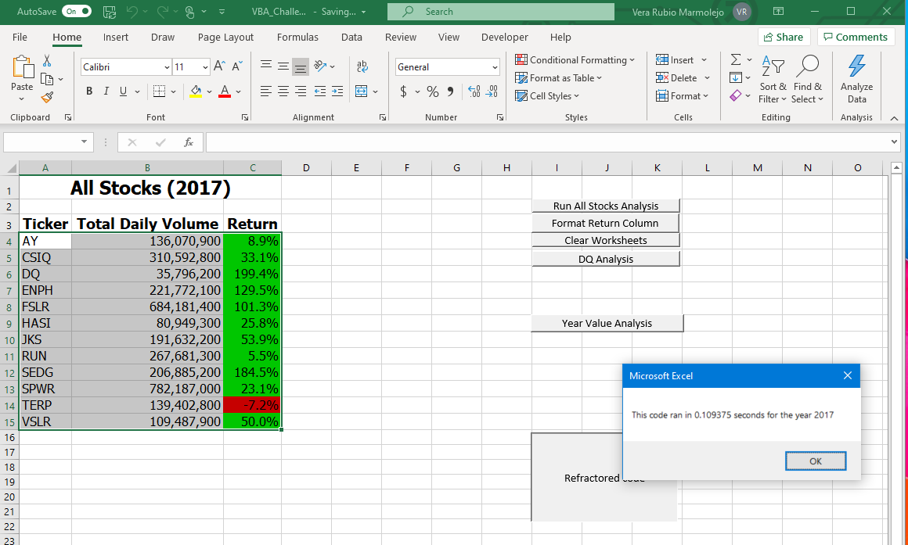
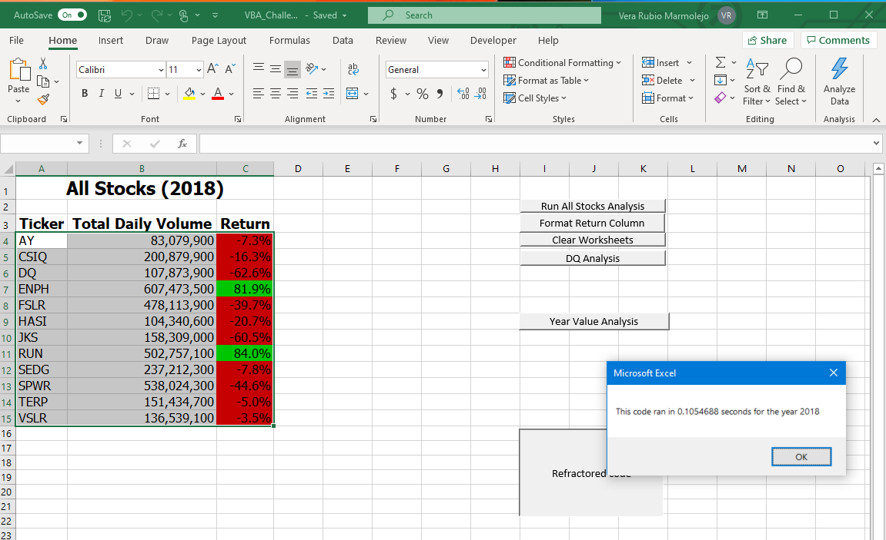

# ***Election Analysis***

## **Project Overview**

### *Background* 

Steve just graduated from college, and his parents became Steve's first clients. Steve's parents are interested in investing on the stock market and believe that investing in green energy or alternative energy is the way to go. Steve asked us for help to analyze different companies in order to diversify his parents investment.

### *Purpose*

The purpose of this analysis is to help Steve visualize the data of the different companies through different years in a simple and efficient way.

## **Results**

### *Overview of Analysis*

According to the analysis for the year **2017**, 11 out of 12 companies were profitable. The tickers that were the most profitable were DQ with a 199.4% Return; SEDG with 184.5%; ENPH with 129.5%. 

However for the analysis for the year **2018**, only 2 out of 12 companies were profitable. The tickers that were profitable were ENPH with 81.9%; and RUN with 84%. 

Noticing the trend in the two year period, the alternative energy company that Steve should recommend his parents to invest is ENPH. 
    

